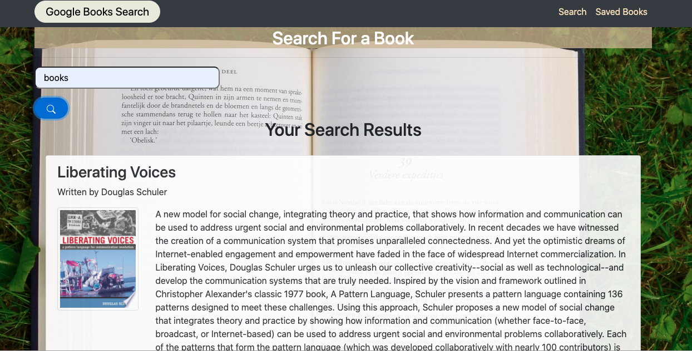
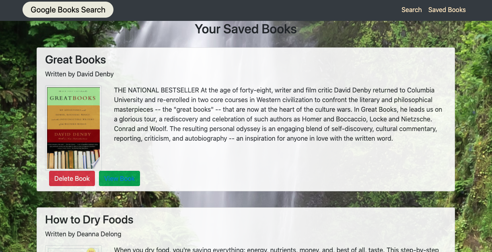

# Google Books Search

## Table of Contents

* [Installation](#installation)
* [Usage](#usage)
* [Credits](#credits)
* [MIT License](#mit_license)

## Installation
1. Clone the repo.
2. Run npm install in terminal.
3. Run npm start in terminal.

## Usage

This is MERN application that is called Google Books Search app. It was created for people who would like to search for books. Also this application allows  users to save choosen books and buy them.

  This app was created using  React components,  helper/util functions, and utilized React lifecycle methods to query and display books based on user searches. Also  Node, Express and MongoDB were used so that users can save books to review or purchase later.

[ Link to the Deployed Google Books Search App](https://google-boks-search.herokuapp.com/)

## Credits

This was a solo project comlepeted by Volodymyr Petrytsya.

## MIT License 

Copyright (c) [2020] [Volodymyr Petrytsya]

Permission is hereby granted, free of charge, to any person obtaining a copy
of this software and associated documentation files (the "Software"), to deal
in the Software without restriction, including without limitation the rights
to use, copy, modify, merge, publish, distribute, sublicense, and/or sell
copies of the Software, and to permit persons to whom the Software is
furnished to do so, subject to the following conditions:

The above copyright notice and this permission notice shall be included in all
copies or substantial portions of the Software.

THE SOFTWARE IS PROVIDED "AS IS", WITHOUT WARRANTY OF ANY KIND, EXPRESS OR
IMPLIED, INCLUDING BUT NOT LIMITED TO THE WARRANTIES OF MERCHANTABILITY,
FITNESS FOR A PARTICULAR PURPOSE AND NONINFRINGEMENT. IN NO EVENT SHALL THE
AUTHORS OR COPYRIGHT HOLDERS BE LIABLE FOR ANY CLAIM, DAMAGES OR OTHER
LIABILITY, WHETHER IN AN ACTION OF CONTRACT, TORT OR OTHERWISE, ARISING FROM,
OUT OF OR IN CONNECTION WITH THE SOFTWARE OR THE USE OR OTHER DEALINGS IN THE
SOFTWARE.
